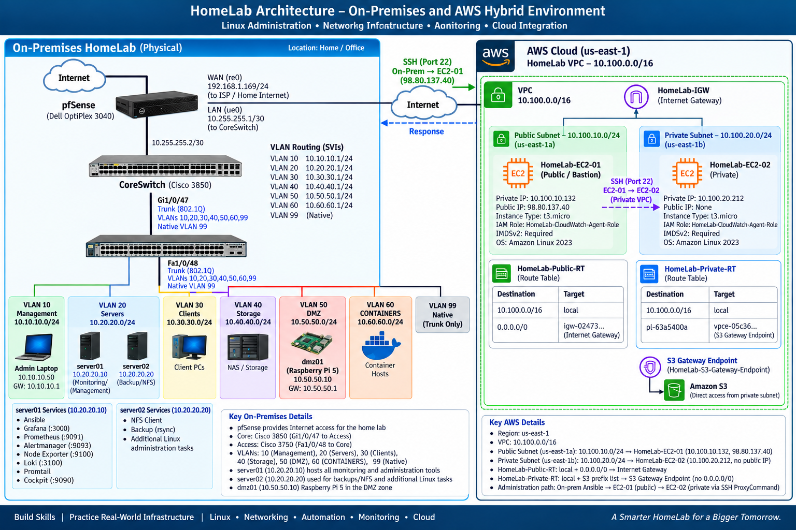
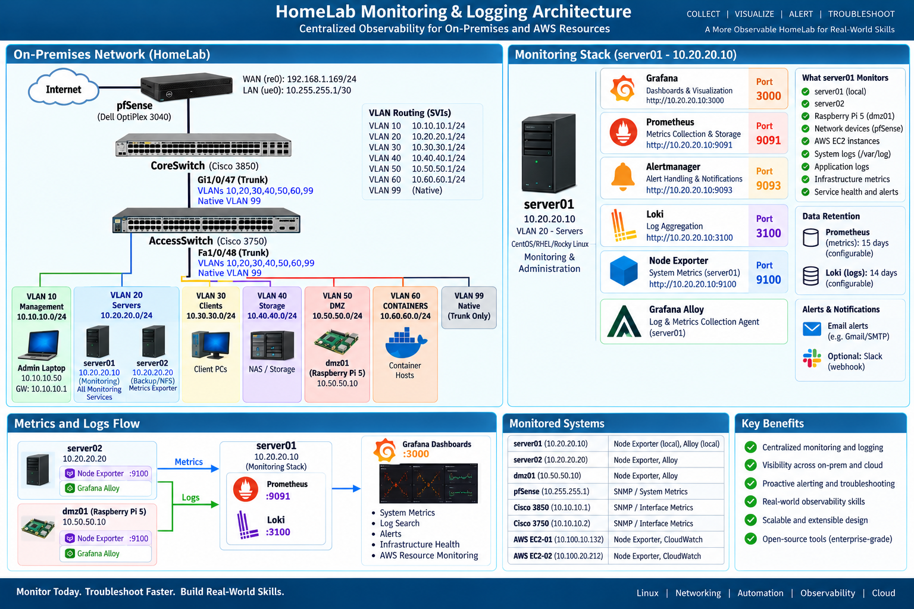
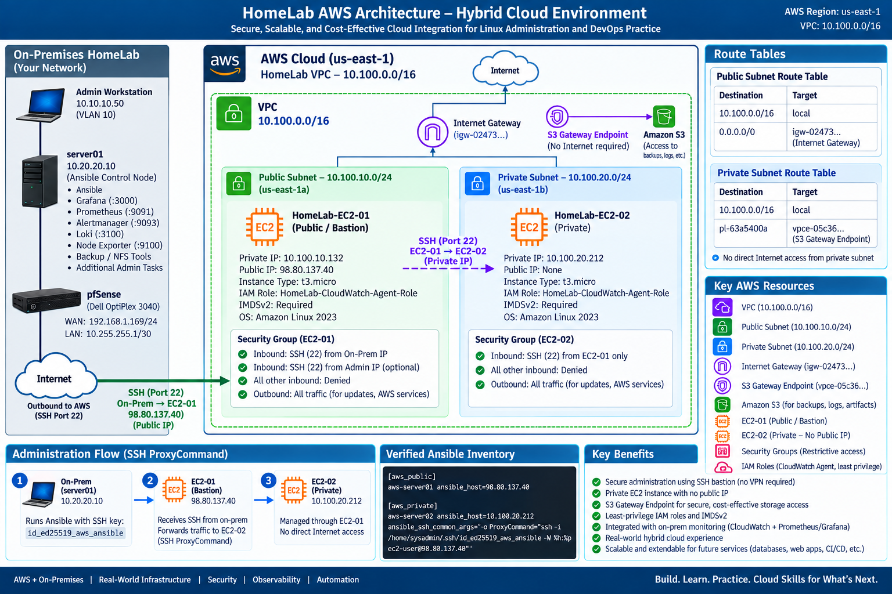

# Main HomeLab — Enterprise Linux & Hybrid Cloud Infrastructure

> A hands-on enterprise-style infrastructure environment built to develop and demonstrate practical skills in Linux administration, networking, automation, security, observability, backup and recovery, and AWS hybrid cloud technologies.
>
> ## Infrastructure Architecture

*Main HomeLab architecture showing the on-premises segmented network, Linux infrastructure, pfSense perimeter routing, Cisco switching, monitoring platform, DMZ services, and AWS hybrid-cloud environment.*

## Project Overview

Main HomeLab is a multi-phase infrastructure project designed to simulate many of the technologies, operational practices, and troubleshooting scenarios encountered in enterprise IT environments.

The environment combines physical networking equipment, Linux servers, centralized administration, infrastructure automation, monitoring and logging, network segmentation, backup services, and AWS cloud resources into a single integrated lab.

Rather than focusing on isolated exercises, the project was built incrementally as an interconnected environment in which networking, Linux administration, security, automation, observability, and cloud infrastructure depend on one another.

## Architecture

The environment consists of an on-premises enterprise-style network connected to AWS resources through controlled Internet-based administrative access.

## Technical Case Studies

The Main HomeLab is documented through focused technical case studies covering the design, implementation, validation, and troubleshooting of the environment.

| Case Study | Focus |
|---|---|
| [Networking & Security](docs/networking-security.md) | Cisco VLANs, 802.1Q trunking, Layer 3 routing, ACL segmentation, pfSense integration, and DMZ architecture |
| [Linux Administration](docs/linux-administration.md) | Rocky Linux and Amazon Linux administration, systemd, networking, SSH, package management, filesystems, permissions, and NFS |
| [Automation & Configuration Management](docs/automation.md) | Ansible inventory design, playbooks, idempotency, SSH key authentication, bastion administration, and hybrid multi-host management |
| [Monitoring & Logging](docs/monitoring-logging.md) | Prometheus, Grafana, Node Exporter, Alertmanager, Loki, Alloy, centralized metrics, logging, and observability troubleshooting |
| [Backup & Recovery](docs/backup-recovery.md) | Automated rsync backups, centralized NFS storage, systemd timers, Ansible validation, and recovery planning |
| [AWS & Hybrid Cloud](docs/aws-hybrid-cloud.md) | AWS VPC networking, public/private subnets, EC2, bastion-based administration, IAM, IMDSv2, S3 Gateway Endpoint, and CloudWatch |

Each case study includes implementation details, validation evidence, and troubleshooting examples from the working lab environment.

### On-Premises Infrastructure

- Cisco Catalyst 3850 Layer-3 core switch
- Cisco Catalyst 3750 access switch
- pfSense firewall/router
- Rocky Linux servers
- Raspberry Pi 5 DMZ host
- VLAN-based network segmentation
- Centralized NFS storage and automated backups

### Linux Administration & Automation

- Rocky Linux server administration
- Ansible configuration management
- Role-based inventory organization
- Automated patch management
- systemd services and timers
- NFS administration
- Backup and recovery automation

### Monitoring & Logging

- Grafana
- Prometheus
- Alertmanager
- Node Exporter
- Loki
- Grafana Alloy
- Centralized infrastructure dashboards
- Metrics, logs, service-health monitoring, and alerting

#### Monitoring & Logging Architecture

*Centralized observability architecture for the Main HomeLab. Prometheus on server01 collects infrastructure metrics from Node Exporter, Grafana provides visualization, Alertmanager handles alerting, and Grafana Alloy forwards system logs from server01 and server02 to Loki for centralized log analysis.*

### AWS Hybrid Cloud

- Amazon VPC
- Public and private subnets
- Amazon EC2
- Internet Gateway
- S3 Gateway Endpoint
- IAM roles
- Amazon CloudWatch
- SSH bastion / ProxyCommand administration
- Ansible management of cloud Linux systems

#### AWS / Hybrid Cloud Architecture

*AWS hybrid-cloud architecture for Main HomeLab, showing a segmented VPC with public and private subnets, a public EC2 bastion host, a private EC2 instance with no public IPv4 address, Internet Gateway routing for the public subnet, S3 Gateway Endpoint access for the private subnet, and Ansible administration through SSH ProxyCommand.*

## Network Segmentation

| VLAN | Purpose | Network |
|---|---|---|
| 10 | Management | 10.10.10.0/24 |
| 20 | Servers | 10.20.20.0/24 |
| 30 | Clients | 10.30.30.0/24 |
| 40 | Storage | 10.40.40.0/24 |
| 50 | DMZ | 10.50.50.0/24 |
| 60 | Containers | 10.60.60.0/24 |
| 99 | Native / Trunk | — |

Inter-VLAN routing is performed by the Cisco Catalyst 3850, with ACLs providing segmentation between security zones. pfSense provides upstream routing and Internet access.

## Key Systems

| System | Role |
|---|---|
| server01 | Linux infrastructure, Ansible control, monitoring and logging services |
| server02 | Linux application/server administration, NFS client, backup operations |
| dmz01 | Raspberry Pi 5 DMZ system |
| CoreSwitch | Cisco 3850 Layer-3 routing and VLAN gateways |
| AccessSwitch | Cisco 3750 Layer-2 access switching |
| pfSense | Firewall, upstream routing, and Internet connectivity |
| HomeLab-EC2-01 | AWS public EC2 instance and SSH bastion |
| HomeLab-EC2-02 | AWS private EC2 instance |

## Skills Demonstrated

**Linux Administration:** Rocky Linux, Amazon Linux, systemd, package management, SSH, permissions, services, storage, NFS, patching, and troubleshooting

**Networking:** VLANs, 802.1Q trunks, Layer-3 switching, SVIs, ACLs, static routing, pfSense, network segmentation, and TCP/IP troubleshooting

**Automation:** Ansible inventories, playbooks, configuration management, patch automation, validation, and idempotency

**Observability:** Prometheus, Grafana, Loki, Alloy, Alertmanager, Node Exporter, CloudWatch, metrics, logs, dashboards, and alerting

**Cloud:** AWS VPC, EC2, public/private subnet architecture, route tables, Internet Gateway, S3 Gateway Endpoint, IAM, IMDSv2, and CloudWatch

**Operations:** Backup and recovery, patch management, security hardening, Git-based change tracking, documentation, and systematic troubleshooting

## Project Documentation

Detailed documentation and implementation evidence will be available throughout this repository, including:

- Network architecture and security
- Linux administration
- Ansible automation
- Monitoring and centralized logging
- Backup and recovery
- AWS hybrid-cloud architecture
- Troubleshooting case studies
- Configuration examples and validation evidence

## Project Goal

The goal of Main HomeLab is to bridge the gap between studying individual technologies and operating an integrated infrastructure environment.

The project emphasizes not only successful implementation, but also **validation, troubleshooting, documentation, security, automation, and operational understanding**.
