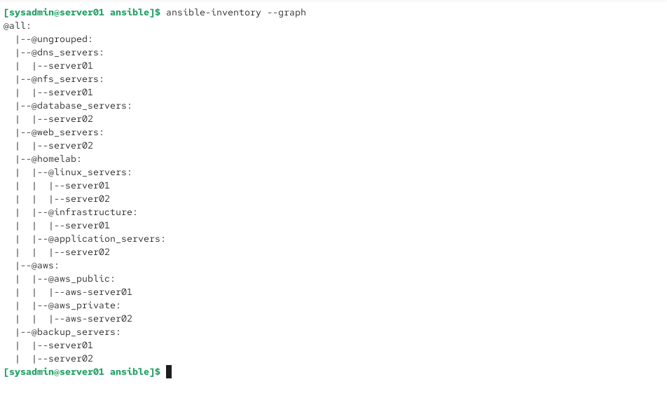
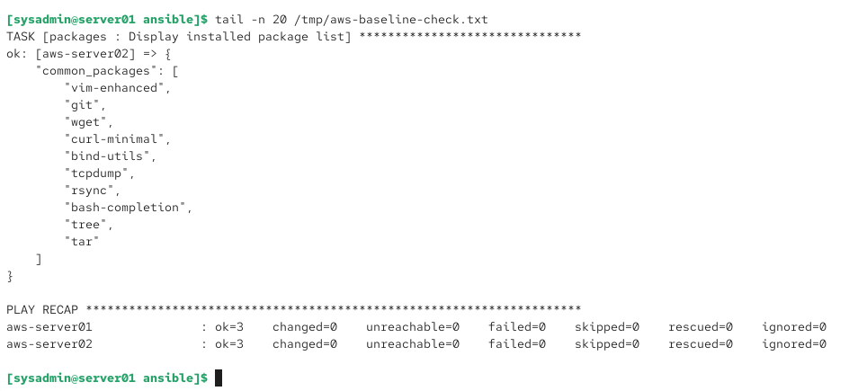

# Automation & Configuration Management

[← Back to Main Portfolio](../README.md)

## Overview

Main HomeLab uses Ansible as the primary configuration-management and automation platform for both on-premises and AWS Linux infrastructure.

`server01` functions as the Ansible control node, providing centralized administration of Rocky Linux systems in the local environment and Amazon Linux EC2 instances in AWS.

The automation design demonstrates inventory management, host grouping, SSH key-based administration, bastion-based access to private cloud systems, reusable playbooks, configuration validation, and idempotent infrastructure management.

## Automation Architecture

```text
                         server01
                    Ansible Control Node
                     10.20.20.10
                          │
              ┌───────────┴───────────┐
              │                       │
        On-Premises Linux            AWS
              │                       │
       ┌──────┴──────┐          ┌─────┴──────────┐
       │             │          │                │
   server01      server02   aws-server01    aws-server02
 Rocky Linux   Rocky Linux  Amazon Linux    Amazon Linux
10.20.20.10   10.20.20.20  Public Subnet   Private Subnet
                             10.100.10.132   10.100.20.212
                                  │
                                  │ SSH ProxyCommand
                                  └──────────────►
                                      aws-server02
```

The private AWS server is not directly exposed to the Internet. Ansible reaches it through `aws-server01`, which functions as the public administration/bastion host.

## Managed Systems

| Host | Platform | Environment | Ansible Group |
|---|---|---|---|
| server01 | Rocky Linux 10 | On-premises | infrastructure / linux_servers |
| server02 | Rocky Linux 10 | On-premises | application_servers / linux_servers |
| aws-server01 | Amazon Linux 2023 | AWS public subnet | aws_public |
| aws-server02 | Amazon Linux 2023 | AWS private subnet | aws_private |

This allows a single control node to manage systems across different Linux distributions and infrastructure environments.

## Role-Based Inventory

The Ansible inventory organizes systems according to their operational roles rather than maintaining only a flat host list.

Groups include:

- `dns_servers`
- `nfs_servers`
- `database_servers`
- `web_servers`
- `linux_servers`
- `infrastructure`
- `application_servers`
- `aws_public`
- `aws_private`
- `backup_servers`

This structure allows playbooks to target systems based on function, environment, or workload.

For example:

```bash
ansible web_servers -m ping
ansible backup_servers -m ping
ansible aws -m ping
ansible all -m ping
```

Role-based grouping makes the automation environment easier to scale and reduces the need to maintain separate automation for individual hosts.

## Secure Remote Administration

Ansible uses SSH key-based authentication rather than interactive passwords.

AWS systems use a dedicated automation key:

```text
/home/sysadmin/.ssh/id_ed25519_aws_ansible
```

The public AWS instance is addressed through its public endpoint, while the private instance uses its private VPC address.

The private host configuration uses SSH ProxyCommand:

```text
Ansible Control Node
        │
        │ SSH
        ▼
aws-server01
Public AWS Instance
        │
        │ ProxyCommand / SSH
        ▼
aws-server02
Private AWS Instance
```

This allows centralized configuration management of a private EC2 instance without assigning that instance a public IPv4 address.

## Playbook-Based Configuration

Configuration-management tasks were moved from repetitive manual administration into Ansible playbooks.

Automation was used throughout the project for activities including:

- baseline Linux configuration
- package installation
- system configuration
- monitoring deployment
- logging configuration
- backup configuration
- patch-management workflows
- AWS host configuration
- operational validation

This creates repeatable infrastructure procedures and reduces configuration drift between managed systems.

## Baseline Configuration

AWS systems were managed through a reusable baseline playbook.

The baseline defines common administrative packages and system configuration expected across the cloud Linux hosts.

Examples of managed packages include:

```text
vim-enhanced
git
wget
curl-minimal
bind-utils
tcpdump
rsync
bash-completion
tree
tar
```

Rather than manually installing and checking packages on each EC2 instance, Ansible provides a consistent desired configuration across the managed hosts.

## Idempotency

An important configuration-management objective was idempotency.

An idempotent automation process can be executed repeatedly without making unnecessary changes once a system already matches the desired configuration.

Ansible check-mode validation of the AWS baseline produced:

```text
aws-server01   ok=3   changed=0   unreachable=0   failed=0
aws-server02   ok=3   changed=0   unreachable=0   failed=0
```

This demonstrates that both AWS systems matched the tested baseline without requiring additional configuration changes.

## Connectivity Validation

Before applying configuration, Ansible connectivity can be validated using:

```bash
ansible all -m ping
```

Successful responses were received from:

```text
aws-server01
aws-server02
server01
server02
```

This validates centralized administrative reachability across both the on-premises and AWS environments.

Importantly, successful management of `aws-server02` also validates the SSH bastion path used to reach the private AWS subnet.

## Implementation Evidence

### Role-Based Ansible Inventory



*Ansible inventory graph showing functional host groups across the Main HomeLab, including DNS, NFS, database, web, infrastructure, application, backup, and separate AWS public/private systems.*

The inventory demonstrates that managed infrastructure is organized according to server role and environment rather than as an unstructured collection of individual hosts.

### Multi-Host Connectivity Validation


*Ansible connectivity validation showing successful responses from all four managed Linux systems: server01, server02, aws-server01, and aws-server02.*

This confirms that the Ansible control node can centrally administer both local Rocky Linux servers and AWS Amazon Linux instances.

### AWS Baseline and Idempotency Validation



*Ansible check-mode validation of the AWS baseline configuration. Both AWS hosts report zero changes, zero unreachable systems, and zero failures.*

The result demonstrates configuration validation and idempotent automation across the AWS Linux environment.

## Troubleshooting Case Study — Private AWS Administration

### Problem

The AWS environment includes a private EC2 instance with no public IPv4 address.

Direct Internet-based SSH administration of the private host was intentionally unavailable because exposing the system publicly would defeat the purpose of the private subnet design.

### Design Approach

The public EC2 instance was used as an administrative bastion.

Ansible inventory variables configure `aws-server02` with its private address:

```text
10.100.20.212
```

and use an SSH ProxyCommand through `aws-server01`.

Conceptually:

```text
server01
Ansible Control Node
        │
        │ SSH over Internet
        ▼
aws-server01
Public Subnet
        │
        │ SSH inside AWS VPC
        ▼
aws-server02
Private Subnet
```

### Validation

The complete path was validated using:

```bash
ansible aws-server01 -m ping
ansible aws-server02 -m ping
```

Both systems returned:

```text
SUCCESS
ping: pong
```

TCP/22 connectivity from the on-premises administration system to the public EC2 instance was also independently validated.

### Lesson Learned

Private infrastructure does not require direct public exposure to remain centrally manageable.

Bastion-based administration provides a controlled management path while preserving the isolation of private cloud workloads.

## Operational Benefits

The completed Ansible implementation provides:

- centralized Linux administration
- consistent system configuration
- repeatable deployments
- role-based targeting
- reduced manual configuration
- configuration-drift reduction
- reusable operational procedures
- hybrid on-premises/cloud management
- private AWS host administration through a controlled bastion path
- validation before and after configuration changes

## Skills Demonstrated

- Ansible administration
- inventory design
- host and group variables
- ad-hoc Ansible commands
- playbook development
- configuration management
- idempotency
- Ansible check mode
- SSH key-based automation
- SSH ProxyCommand
- bastion-host administration
- Linux package automation
- multi-host administration
- hybrid cloud automation
- operational validation
- infrastructure documentation

---

[← Back to Main Portfolio](../README.md)
