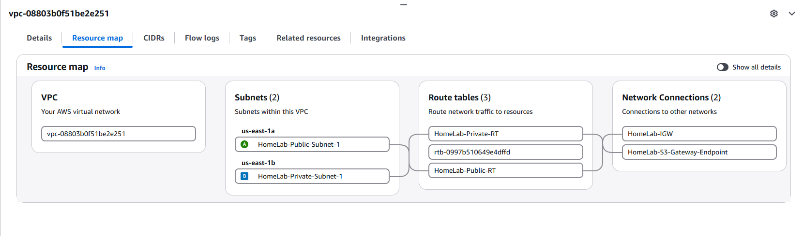
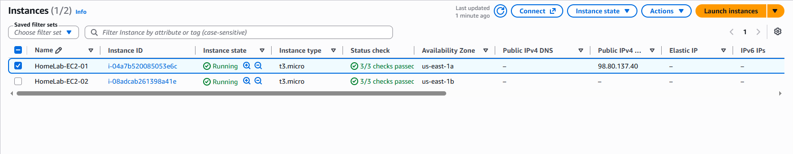
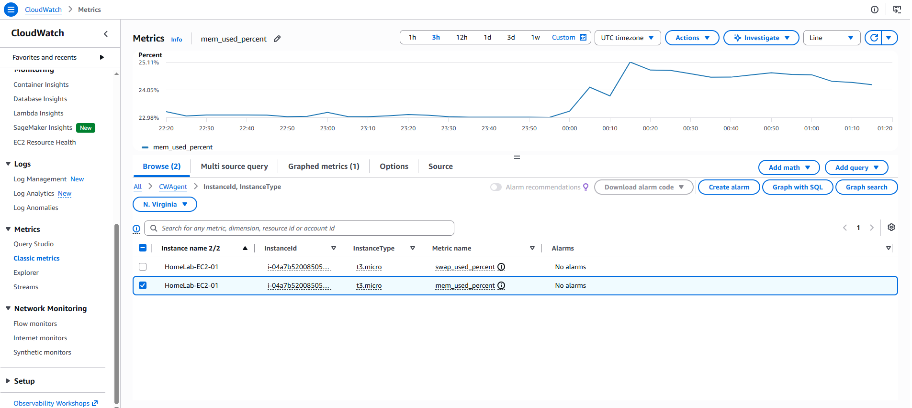

# AWS & Hybrid Cloud

[← Back to Main Portfolio](../README.md)

## Overview

Main HomeLab extends beyond the local enterprise-style network into AWS, creating a hybrid administration environment that combines on-premises Linux systems with cloud-based Amazon Linux EC2 instances.

The AWS environment was designed to demonstrate practical cloud networking, public and private subnet architecture, controlled administrative access, centralized automation, IAM integration, monitoring, logging, and operational validation.

The implementation uses a dedicated VPC with separate public and private subnets, a public administration host, a private Linux server with no public IPv4 address, and Ansible-based management from the on-premises environment.

## Hybrid Cloud Architecture


The environment does not use a site-to-site VPN or Direct Connect connection.

Instead, administration follows a controlled SSH path:

```text
On-Premises Main HomeLab
        │
        │ SSH over Internet
        ▼
aws-server01
AWS Public Subnet
        │
        │ SSH ProxyCommand
        ▼
aws-server02
AWS Private Subnet
```

This design provides access to the private cloud server without assigning it a public IPv4 address.

## AWS Environment

| Component | Value |
|---|---|
| AWS Region | us-east-1 |
| VPC CIDR | 10.100.0.0/16 |
| Public Subnet | 10.100.10.0/24 |
| Private Subnet | 10.100.20.0/24 |
| Public EC2 Host | aws-server01 |
| Private EC2 Host | aws-server02 |
| Operating System | Amazon Linux 2023 |
| Public Host Role | Administration / Bastion |
| Private Host Role | Internal Linux workload |
| Automation | Ansible |
| Monitoring | Amazon CloudWatch |

## VPC Architecture

The AWS environment uses a dedicated VPC:

```text
10.100.0.0/16
```

Two subnets separate public-facing administration from private workloads.

### Public Subnet

```text
10.100.10.0/24
```

The public subnet is located in:

```text
us-east-1a
```

and is associated with the public route table.

The public route table includes:

```text
10.100.0.0/16  local
0.0.0.0/0      Internet Gateway
```

This allows resources placed in the public subnet to communicate with external networks when their security configuration permits it.

### Private Subnet

```text
10.100.20.0/24
```

The private subnet is located in:

```text
us-east-1b
```

The private route table does not contain a default Internet route.

This prevents the private EC2 instance from having direct Internet connectivity through an Internet Gateway.

The private route table also includes access to Amazon S3 through a VPC Gateway Endpoint.

## Internet Gateway

The AWS environment includes an Internet Gateway attached to the VPC.

The Internet Gateway is associated with the public routing design and provides the external path used by the public EC2 administration host.

The private subnet does not route directly through the Internet Gateway.

This separation allows the environment to maintain a publicly reachable administration tier while keeping the internal workload private.

## S3 Gateway Endpoint

The private subnet uses an Amazon S3 Gateway Endpoint.

This provides a VPC-native route to Amazon S3 without requiring the private subnet to use a NAT Gateway or direct Internet route.

The design demonstrates how private cloud systems can access selected AWS services without exposing general Internet connectivity.

## EC2 Compute

The environment contains two Amazon Linux 2023 EC2 instances.

### aws-server01

`aws-server01` is the public administration host.

```text
Private IP: 10.100.10.132
Subnet:     Public
AZ:         us-east-1a
Type:       t3.micro
```

This instance has a public IPv4 address and provides the SSH entry point into the AWS environment.

It also functions as the bastion used to reach the private EC2 instance.

### aws-server02

`aws-server02` is the private Linux server.

```text
Private IP: 10.100.20.212
Subnet:     Private
AZ:         us-east-1b
Type:       t3.micro
Public IPv4: None
```

The absence of a public IPv4 address prevents direct Internet-based administration of this system.

Instead, access is performed through the public EC2 instance.

## Bastion-Based Administration

The private EC2 instance is administered through `aws-server01`.

The administrative path is:

```text
server01
On-Premises Ansible Control Node
        │
        │ SSH
        ▼
aws-server01
Public AWS Instance
        │
        │ SSH ProxyCommand
        ▼
aws-server02
Private AWS Instance
```

This approach allows centralized administration while preserving the private subnet design.

The private instance does not need a public address simply to remain manageable.

## Ansible Integration

The on-premises `server01` system functions as the Ansible control node for both the local and AWS Linux environments.

AWS inventory configuration uses the public EC2 address for `aws-server01` and the private VPC address for `aws-server02`.

Conceptually:

```text
aws-server01
  ansible_host = public endpoint

aws-server02
  ansible_host = 10.100.20.212
  SSH ProxyCommand through aws-server01
```

The complete management path was validated using:

```bash
ansible aws-server01 -m ping
ansible aws-server02 -m ping
```

Both systems returned successful Ansible responses.

This demonstrates centralized hybrid administration across different Linux distributions and infrastructure locations.

## Connectivity Validation

Connectivity from the on-premises environment to the public AWS host was independently validated on TCP port 22.

The public administration host successfully accepted the SSH connection path.

The private host was then validated through the bastion using Ansible.

Successful Ansible connectivity to `aws-server02` proves that the SSH ProxyCommand path through the public instance is operational.

## IAM Integration

AWS EC2 instances use an IAM role:

```text
HomeLab-CloudWatch-Agent-Role
```

This allows AWS monitoring components to interact with CloudWatch using instance-based permissions rather than storing long-lived AWS access keys directly on the systems.

The use of IAM roles provides a more appropriate cloud-native authorization model for EC2 workloads.

## Instance Metadata Security

The AWS EC2 systems were configured to require IMDSv2.

Requiring IMDSv2 improves protection of instance metadata by requiring session-oriented metadata access rather than permitting unrestricted legacy metadata requests.

This demonstrates attention to cloud instance security in addition to basic compute deployment.

## CloudWatch Monitoring

CloudWatch Agent was configured on `aws-server01`.

The agent publishes operating-system metrics into the:

```text
CWAgent
```

namespace.

Validated metrics include:

```text
mem_used_percent
swap_used_percent
disk_used_percent
disk_inodes_free
```

This extends monitoring beyond standard EC2 platform metrics and provides visibility into guest operating-system resource usage.

## CloudWatch Logging

CloudWatch Logs is used to centralize selected Linux log data from the public EC2 instance.

Configured log groups include:

```text
/homelab/aws/sshd
/homelab/aws/system-warnings
```

The log groups use a seven-day retention period.

This provides centralized access to selected security and operational Linux logs within AWS.

## Implementation Evidence

### AWS VPC Resource Map



*AWS VPC resource map showing the Main HomeLab public and private subnets, separate route tables, Internet Gateway connectivity, and the S3 Gateway Endpoint.*

The resource map demonstrates that the AWS environment is segmented into distinct public and private networking tiers rather than using a single flat subnet.

### Public and Private EC2 Instances



*AWS EC2 inventory showing two running Amazon Linux instances deployed across separate Availability Zones. The public administration instance has a public IPv4 address, while the private instance has no public IPv4 address.*

This evidence demonstrates the separation between the externally reachable administration host and the isolated private workload.

### CloudWatch Guest Operating-System Metrics



*Amazon CloudWatch displaying the `mem_used_percent` metric published by the CloudWatch Agent from the public EC2 instance.*

The metric demonstrates successful guest operating-system monitoring through the `CWAgent` namespace.

## Troubleshooting Case Study — Private AWS Administration

### Problem

The private EC2 instance was intentionally deployed without a public IPv4 address.

As a result, direct SSH administration from the Internet was unavailable.

This was expected behavior, but a controlled administrative path was still required so the system could be managed through Ansible.

### Investigation

The AWS network architecture was reviewed to identify a management path that preserved the private subnet design.

The public EC2 instance already had controlled SSH reachability and could communicate with systems inside the VPC.

Rather than assigning the private instance a public address, SSH ProxyCommand was configured so that Ansible would connect through the public instance.

The private host continued to use its private VPC address:

```text
10.100.20.212
```

### Validation

The public EC2 SSH path was validated first.

The private host was then tested using:

```bash
ansible aws-server02 -m ping
```

The command returned:

```text
SUCCESS
ping: pong
```

This confirmed that the Ansible control node could successfully reach the private AWS instance through the bastion host.

### Resolution

No public IPv4 address was added to `aws-server02`.

The public EC2 instance remained the controlled administrative entry point, while the private EC2 instance remained isolated within the private subnet.

### Lesson Learned

Private cloud systems do not require direct public exposure in order to remain centrally manageable.

A bastion-based administration model can provide controlled access while preserving subnet isolation and reducing unnecessary public attack surface.

## Troubleshooting Case Study — CloudWatch Agent Configuration

### Problem

CloudWatch monitoring required configuration beyond the default EC2 platform metrics so that Linux guest operating-system metrics could be collected.

During implementation, CloudWatch Agent configuration and validation required careful verification of agent state, configuration syntax, metric publication, and AWS permissions.

### Validation Approach

The CloudWatch Agent service and configuration were validated on the EC2 instance.

The resulting metrics were then confirmed in the AWS CloudWatch console under the:

```text
CWAgent
```

namespace.

Published metrics included:

```text
mem_used_percent
swap_used_percent
disk_used_percent
disk_inodes_free
```

### Result

CloudWatch successfully received guest operating-system metrics from `aws-server01`.

The configuration also supported centralized Linux log collection into the configured CloudWatch log groups.

### Lesson Learned

Cloud monitoring should be validated end-to-end.

A running local agent alone does not prove that monitoring is complete.

The service, IAM permissions, configuration, outbound connectivity, CloudWatch namespace, published metrics, and log destinations all need to be verified.

## Hybrid Cloud Operational Model

The completed environment combines on-premises and cloud administration without pretending that the two networks are directly connected.

The actual operational relationship is:

```text
On-Premises Linux Administration
        │
        ├── Local Rocky Linux Servers
        │
        └── SSH over Internet
                │
                ▼
        AWS Public EC2
                │
                ▼
        AWS Private EC2
```

Ansible provides a common management layer across both environments.

This creates a practical hybrid administration model while keeping the underlying networking architecture accurate and easy to understand.

## Operational Benefits

The AWS implementation provides:

- dedicated VPC networking
- public and private subnet segmentation
- controlled Internet access
- private EC2 workload isolation
- bastion-based private host administration
- Ansible-based hybrid configuration management
- Amazon Linux administration
- IAM role integration
- IMDSv2 enforcement
- S3 Gateway Endpoint connectivity
- CloudWatch guest OS metrics
- centralized AWS log collection
- multi-AZ EC2 placement
- cloud networking validation
- infrastructure security controls
- operational troubleshooting experience

## Skills Demonstrated

- AWS VPC administration
- CIDR planning
- public and private subnet design
- route-table administration
- Internet Gateway configuration
- VPC Gateway Endpoints
- EC2 administration
- Amazon Linux 2023
- bastion-host administration
- SSH ProxyCommand
- Ansible AWS administration
- IAM roles
- IMDSv2
- CloudWatch Agent
- CloudWatch Metrics
- CloudWatch Logs
- hybrid Linux administration
- cloud security
- cloud troubleshooting
- infrastructure documentation

---

[← Back to Main Portfolio](../README.md)
