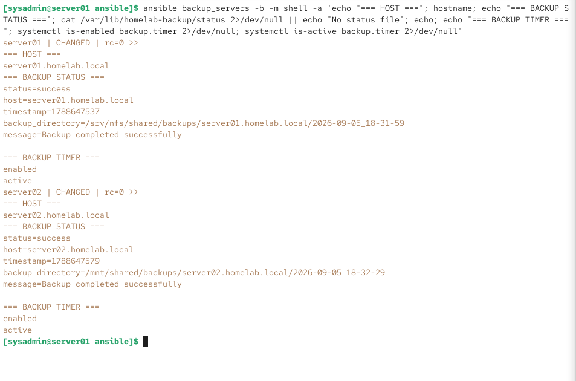

# Backup & Recovery

[← Back to Main Portfolio](../README.md)

## Overview

Main HomeLab implements automated Linux backup operations using rsync, centralized NFS storage, systemd scheduling, and Ansible-based operational validation.

The backup design provides scheduled protection for the Rocky Linux server environment while maintaining centralized backup storage and status reporting.

`server01` provides the centralized NFS storage used by the backup environment, while backup operations on the Linux systems are scheduled through systemd timers.

## Backup Architecture

```text
                         Main HomeLab
                              │
                    Automated Linux Backups
                              │
                 ┌────────────┴────────────┐
                 │                         │
             server01                  server02
          Rocky Linux 10            Rocky Linux 10
          10.20.20.10               10.20.20.20
                 │                         │
                 │ rsync                   │ rsync
                 │                         │
                 └────────────┬────────────┘
                              │
                              ▼
                    Centralized NFS Storage
                         on server01
                     /srv/nfs/shared
                              │
                              ▼
                           backups/
```

The NFS share hosted by `server01` provides centralized storage that can be accessed by `server02` through:

```text
/mnt/shared
```

This allows backup data from multiple Linux systems to be organized within a common storage location.

## Backup Components

| Component | System | Purpose |
|---|---|---|
| rsync | server01 / server02 | File synchronization and backup operations |
| NFS server | server01 | Centralized network backup storage |
| NFS client | server02 | Access to centralized backup storage |
| backup script | Linux servers | Executes backup workflow |
| systemd service | Linux servers | Runs backup operation |
| systemd timer | Linux servers | Schedules automated backups |
| status file | Linux servers | Records latest backup result |
| Ansible | server01 | Centralized backup-state validation |

Together, these components provide a repeatable backup workflow without requiring an administrator to manually initiate each backup.

## Centralized NFS Storage

`server01` provides the centralized NFS share:

```text
/srv/nfs/shared
```

`server02` accesses the share through:

```text
/mnt/shared
```

The NFS connection was validated as an NFSv4.2 mount between:

```text
server01  10.20.20.10
server02  10.20.20.20
```

Backup directories are created beneath the centralized storage hierarchy.

Example backup locations include:

```text
/srv/nfs/shared/backups/server01.homelab.local/
/mnt/shared/backups/server02.homelab.local/
```

Timestamped directories allow backup runs to be separated and identified according to the system and execution time.

## Rsync-Based Backup Operations

Backup data is synchronized using `rsync`.

Rsync provides an efficient mechanism for transferring filesystem data while preserving the attributes required by the backup workflow.

The backup process writes data into host-specific directories on centralized NFS storage.

Conceptually:

```text
server01 filesystem
        │
        │ rsync
        ▼
/srv/nfs/shared/backups/server01.homelab.local/

server02 filesystem
        │
        │ rsync
        ▼
/mnt/shared/backups/server02.homelab.local/
```

This keeps backup data organized by source system.

## Automated Scheduling with systemd

Backup execution is automated using systemd services and timers.

The timer can be validated with:

```bash
systemctl is-enabled backup.timer
systemctl is-active backup.timer
```

The completed environment reports:

```text
enabled
active
```

on both Linux servers.

Using a systemd timer provides operating-system-native scheduling and allows backup execution to be managed and inspected using standard Linux administration tools.

## Backup Status Reporting

Each managed Linux system maintains backup status information under:

```text
/var/lib/homelab-backup/status
```

The status data records information about the most recent backup operation, including:

```text
status
host
timestamp
backup_directory
message
```

A successful backup reports:

```text
status=success
message=Backup completed successfully
```

This provides a simple operational mechanism for determining whether the latest backup completed successfully and where the resulting backup data was stored.

## Centralized Validation with Ansible

Backup state can be checked across multiple systems from the Ansible control node.

The validation command used in the environment was:

```bash
ansible backup_servers -b -m shell -a 'echo "=== HOST ==="; hostname; echo "=== BACKUP STATUS ==="; cat /var/lib/homelab-backup/status 2>/dev/null || echo "No status file"; echo; echo "=== BACKUP TIMER ==="; systemctl is-enabled backup.timer 2>/dev/null; systemctl is-active backup.timer 2>/dev/null'
```

This checks both the most recent backup result and the state of the scheduling timer.

The validation returned successful backup states for:

```text
server01.homelab.local
server02.homelab.local
```

with `backup.timer` reporting:

```text
enabled
active
```

on both systems.

This provides centralized operational verification without requiring separate interactive sessions to each server.

## Implementation Evidence

### Automated Backup Validation



*Ansible-based validation showing successful backup completion on both Rocky Linux servers, centralized NFS-backed backup destinations, and enabled and active systemd backup timers.*

The evidence demonstrates that both systems completed their most recent backup successfully and that automated scheduling remains enabled and operational.

It also shows host-specific, timestamped backup directories stored through the centralized NFS infrastructure.

## Troubleshooting Case Study — Rsync and NFS Metadata

### Problem

During implementation of the backup workflow, an rsync operation against the NFS-backed storage encountered errors and returned exit code:

```text
23
```

The backup process was able to transfer data, but some filesystem metadata operations were not compatible with the behavior of the NFS-backed destination.

### Investigation

The backup workflow was reviewed to distinguish between file-transfer failures and metadata-related errors.

The issue involved rsync attempting to preserve extended attributes and ACL information that was not required by this backup design and caused problems on the NFS destination.

Rather than treating the entire NFS storage path as unavailable, the rsync behavior was adjusted to match the requirements of the backup target.

### Resolution

The backup command was configured with options including:

```text
--no-xattrs
--no-acls
```

These options prevent rsync from attempting to preserve extended attributes and ACL metadata that were not required for this backup workflow.

After the adjustment, the backup process completed successfully against the centralized NFS storage.

### Lesson Learned

Backup failures should be investigated at the level of the actual operation that failed rather than assuming the entire storage or network path is unavailable.

Exit codes, filesystem behavior, permissions, security controls, and destination capabilities all need to be considered when troubleshooting automated backup jobs.

The resolution also reinforced the importance of matching backup-tool options to the capabilities and requirements of the destination filesystem.

## Recovery Considerations

Centralized, host-specific backup directories provide a foundation for restoring files to the Linux environment.

The backup structure identifies both the source system and backup execution time, making it possible to locate the appropriate backup dataset during recovery operations.

For example:

```text
backups/
├── server01.homelab.local/
│   └── <timestamped-backup>
│
└── server02.homelab.local/
    └── <timestamped-backup>
```

Recovery operations should identify the required backup dataset, validate the contents, and restore the required files to the appropriate destination.

The current implementation evidence validates successful backup creation and scheduling. It does not claim a fully tested enterprise disaster-recovery platform or automated bare-metal recovery process.

This distinction keeps the documented recovery capabilities aligned with the procedures actually implemented and validated in the lab.

## Operational Benefits

The completed backup implementation provides:

- automated Linux backup execution
- centralized NFS-backed storage
- host-specific backup organization
- timestamped backup directories
- systemd-based scheduling
- backup status reporting
- multi-host validation through Ansible
- repeatable rsync-based backup operations
- centralized operational visibility
- reduced dependence on manual backup execution
- documented troubleshooting procedures
- a foundation for file-level recovery

## Skills Demonstrated

- Linux backup administration
- rsync
- NFS
- NFSv4.2
- systemd services
- systemd timers
- shell scripting
- backup automation
- backup status validation
- Ansible administration
- multi-host operational validation
- Linux filesystem administration
- permissions and metadata troubleshooting
- backup troubleshooting
- recovery planning
- infrastructure documentation

---

[← Back to Main Portfolio](../README.md)
