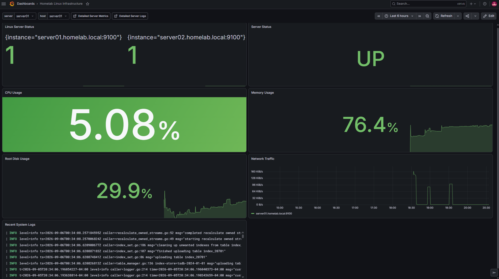

# Monitoring & Logging

[← Back to Main Portfolio](../README.md)

## Overview

Main HomeLab uses a centralized monitoring and logging stack to provide visibility into Linux system availability, resource utilization, network activity, alerts, and system logs.

The monitoring platform is hosted primarily on `server01` and uses Prometheus, Node Exporter, Grafana, Alertmanager, Loki, and Grafana Alloy.

Metrics are collected from both on-premises Rocky Linux servers, while system logs are forwarded to a centralized Loki instance for analysis and visualization through Grafana.

## Monitoring Architecture


The monitoring environment separates metrics collection from log aggregation while providing a common visualization layer through Grafana.

### Metrics Pipeline

```text
server01 Node Exporter :9100 ─┐
                              ├──> Prometheus :9091 ───> Grafana :3000
server02 Node Exporter :9100 ─┘          │
                                         └──> Alertmanager :9093
```

### Logging Pipeline

```text
server01 systemd journal ──> Alloy ─┐
                                    ├──> Loki :3100 ───> Grafana :3000
server02 systemd journal ──> Alloy ─┘
```

This architecture provides centralized visibility while allowing each Linux server to expose or forward only the information required by the monitoring platform.

## Monitoring Systems

| Component | Host | Port | Purpose |
|---|---|---:|---|
| Grafana | server01 | 3000 | Dashboards and visualization |
| Prometheus | server01 | 9091 | Metrics collection and storage |
| Alertmanager | server01 | 9093 | Alert processing |
| Loki | server01 | 3100 | Centralized log aggregation |
| Node Exporter | server01 | 9100 | Linux host metrics |
| Node Exporter | server02 | 9100 | Linux host metrics |
| Grafana Alloy | server01 | — | Journal collection and log forwarding |
| Grafana Alloy | server02 | — | Journal collection and log forwarding |

`server01` functions as the central observability host while also being monitored as a Linux system itself.

## Prometheus Metrics Collection

Prometheus provides centralized collection and storage of infrastructure metrics.

The Prometheus service on `server01` is configured to listen on:

```text
:9091
```

Its configuration includes Node Exporter targets for both Linux servers:

```text
server01.homelab.local:9100
server02.homelab.local:9100
```

Prometheus therefore collects host-level metrics from both systems while maintaining a centralized time-series data store on `server01`.

Examples of monitored information include:

- server availability
- CPU utilization
- memory utilization
- filesystem utilization
- network activity
- operating-system metrics

## Node Exporter

Node Exporter runs on both Rocky Linux servers and exposes Linux system metrics to Prometheus.

```text
server01.homelab.local:9100
server02.homelab.local:9100
```

This provides a consistent metrics interface across the Linux infrastructure.

Successful Prometheus collection from both exporters is reflected in the Grafana dashboard, where both monitored instances report an available state.

## Grafana Visualization

Grafana provides the primary visualization interface for the monitoring environment.

The **Homelab Linux Infrastructure** dashboard combines several operational views into a single interface, including:

- Linux server availability
- CPU utilization
- memory utilization
- root filesystem utilization
- network traffic
- recent system logs

This provides a centralized operational view rather than requiring administrators to inspect each Linux server independently.

## Alerting

Prometheus is integrated with Alertmanager on `server01`.

```text
Prometheus :9091
       │
       ▼
Alertmanager :9093
```

Prometheus loads alerting rules from:

```text
/etc/prometheus/rules/alerts.yml
```

and forwards generated alerts to Alertmanager.

This separates metric evaluation from alert handling and provides a foundation for centralized infrastructure alerting.

## Centralized Logging

Centralized logging is implemented with Grafana Alloy and Loki.

Grafana Alloy runs on both Linux servers and collects systemd journal data.

The collected logs are forwarded to the centralized Loki service:

```text
http://server01.homelab.local:3100/loki/api/v1/push
```

The resulting flow is:

```text
server01 journal ──> Alloy ─┐
                             ├──> Loki ───> Grafana
server02 journal ──> Alloy ─┘
```

This allows logs from multiple systems to be viewed through a common interface without manually connecting to each server and inspecting its local journal.

## Service Validation

The monitoring stack was validated at both the service and application layers.

Key services were confirmed operational on `server01`, including:

```text
Grafana        :3000
Loki           :3100
Alertmanager   :9093
Prometheus     :9091
Node Exporter  :9100
```

Grafana was validated through its web interface, Prometheus configuration and process state were inspected directly, and Loki readiness was validated through its HTTP readiness endpoint.

Node Exporter data from both Linux systems was also confirmed through the centralized dashboard.

## Implementation Evidence

### Centralized Linux Infrastructure Monitoring



*Grafana dashboard providing centralized visibility into the Main HomeLab Linux environment, including host availability, CPU utilization, memory utilization, filesystem usage, network traffic, and recent system logs.*

The dashboard demonstrates that monitoring and logging information from multiple Linux systems is available through a centralized operational interface.

Both Node Exporter targets are visible as available, while system resource metrics and recent log data provide additional operational context.

## Troubleshooting Case Study — Prometheus Port Validation

### Problem

During monitoring-stack validation, port `9090` was initially checked because it is commonly associated with Prometheus.

The response did not match the expected Prometheus interface.

Rather than assuming that Prometheus had failed, the listening services and running processes were inspected to determine which application actually owned the port.

### Investigation

Inspection showed that port:

```text
9090
```

was being used by Cockpit.

The running Prometheus process showed:

```text
/usr/local/bin/prometheus \
  --config.file=/etc/prometheus/prometheus.yml \
  --storage.tsdb.path=/var/lib/prometheus \
  --web.listen-address=:9091
```

This established that Prometheus was intentionally configured to listen on:

```text
9091
```

rather than `9090`.

The Prometheus configuration was then inspected using the correct service endpoint.

### Resolution

No service repair was required.

The issue was resolved by identifying the actual port assignment and validating Prometheus on `9091`.

The final service allocation was:

```text
Cockpit      :9090
Prometheus   :9091
Alertmanager :9093
Node Exporter:9100
```

### Lesson Learned

Default application ports should not be assumed when troubleshooting service reachability.

Process arguments, socket ownership, service configuration, and active listeners provide more reliable evidence of the actual application state.

This troubleshooting process prevented a correctly operating Prometheus service from being misdiagnosed as unavailable.

## Operational Benefits

The completed monitoring and logging platform provides:

- centralized Linux infrastructure visibility
- multi-host metrics collection
- system availability monitoring
- CPU and memory monitoring
- filesystem utilization monitoring
- network activity visibility
- centralized system logging
- time-series metric storage
- dashboard-based operational analysis
- centralized alert processing
- service-health validation
- reduced dependence on individual host inspection

## Skills Demonstrated

- Prometheus administration
- Grafana dashboarding
- Node Exporter deployment
- Alertmanager integration
- Loki administration
- Grafana Alloy configuration
- centralized logging
- systemd journal collection
- Linux service monitoring
- time-series metrics
- observability architecture
- service-port validation
- troubleshooting with process and socket inspection
- operational monitoring
- infrastructure documentation

---

[← Back to Main Portfolio](../README.md)
