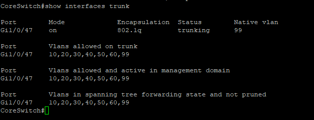
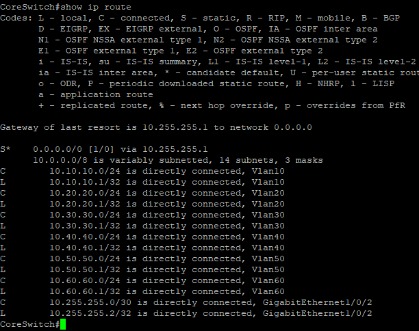
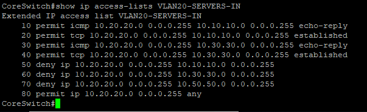
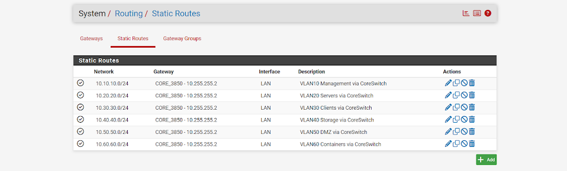

# Networking & Security

[← Back to Main Portfolio](../README.md)

## Overview

Main HomeLab uses an enterprise-style segmented network built around a Cisco Catalyst 3850 Layer-3 core switch, Cisco Catalyst 3750 access switch, and pfSense firewall/router.

The network was designed to provide separate security and functional zones for management, servers, clients, storage, DMZ systems, and container workloads while maintaining controlled communication between those networks.

## Network Architecture

| Component | Role |
|---|---|
| Cisco Catalyst 3850 | Layer-3 core switching, inter-VLAN routing, SVIs, and ACL enforcement |
| Cisco Catalyst 3750 | Layer-2 access switching and endpoint connectivity |
| pfSense | Upstream routing, firewall services, and Internet connectivity |
| Raspberry Pi 5 | DMZ host (`dmz01`) |
| server01 / server02 | Linux systems on the Servers VLAN |
| Management workstation | Administrative system on the Management VLAN |

## VLAN Design

| VLAN | Name | Network | Gateway |
|---|---|---|---|
| 10 | MANAGEMENT | 10.10.10.0/24 | 10.10.10.1 |
| 20 | SERVERS | 10.20.20.0/24 | 10.20.20.1 |
| 30 | CLIENTS | 10.30.30.0/24 | 10.30.30.1 |
| 40 | STORAGE | 10.40.40.0/24 | 10.40.40.1 |
| 50 | DMZ | 10.50.50.0/24 | 10.50.50.1 |
| 60 | CONTAINERS | 10.60.60.0/24 | 10.60.60.1 |
| 99 | NATIVE | — | — |

The Cisco Catalyst 3850 provides the Layer-3 gateway for each routed VLAN.

## Core-to-Access Switching

The operational 802.1Q trunk between the switches is:

```text
CoreSwitch Gi1/0/47
        │
        │ 802.1Q trunk
        │ Native VLAN 99
        │ Allowed VLANs:
        │ 10,20,30,40,50,60,99
        │
AccessSwitch Fa1/0/48
```

The Cisco 3750 also has a management SVI at `10.10.10.2/24` with `10.10.10.1` configured as its default gateway.

## Layer-3 Routing

Inter-VLAN routing is performed by the Cisco Catalyst 3850 using switched virtual interfaces (SVIs).

The core switch connects to pfSense through a dedicated Layer-3 transit network:

```text
Cisco 3850 Gi1/0/2
10.255.255.2/30
        │
        │ Routed transit
        │ 10.255.255.0/30
        │
pfSense LAN / Transit
10.255.255.1/30
```

The Cisco 3850 uses pfSense as its default route:

```text
0.0.0.0/0 → 10.255.255.1
```

pfSense maintains static return routes for the internal VLAN networks through the Cisco 3850 at:

```text
10.255.255.2
```

This provides bidirectional route knowledge between the segmented internal networks and the upstream firewall.

## Network Security

Network segmentation is enforced through inbound extended ACLs on the routed VLAN interfaces.

ACLs are applied to:

- VLAN 20 — Servers
- VLAN 30 — Clients
- VLAN 40 — Storage
- VLAN 50 — DMZ
- VLAN 60 — Containers

VLAN 10 serves as the privileged Management network.

The ACL design permits required reply and established traffic while restricting unnecessary initiation of connections between security zones.

For example, `VLAN20-SERVERS-IN` permits ICMP echo replies and established TCP return traffic toward the Management and Client networks while denying new server-initiated traffic toward protected Management, Client, and DMZ segments.

This design provides policy-based segmentation rather than relying only on separate IP subnets.

## DMZ

VLAN 50 provides a dedicated DMZ network:

```text
VLAN 50 — DMZ
10.50.50.0/24
Gateway: 10.50.50.1

dmz01
Raspberry Pi 5
10.50.50.10/24
```

The DMZ is separated from other internal security zones through the Layer-3 ACL policy.

## Validation

The final network configuration was validated using Cisco IOS/IOS XE and pfSense operational data.

Validation confirmed:

- All required VLANs exist on the switching infrastructure
- The core-to-access 802.1Q trunk carries VLANs 10,20,30,40,50,60,99
- Layer-3 SVIs provide the expected VLAN gateways
- The Cisco 3850 routes between the internal VLANs
- The Cisco 3850 has a default route through pfSense
- pfSense maintains return routes for all six routed VLAN networks
- Security ACLs are applied to the appropriate routed VLAN interfaces

### Implementation Evidence

#### 802.1Q Trunk Validation



*Cisco Catalyst 3850 trunk validation showing Gi1/0/47 operating as an 802.1Q trunk with native VLAN 99. VLANs 10,20,30,40,50,60,99 are allowed, active, and forwarding.*

#### Layer-3 Routing Validation



*Cisco Catalyst 3850 routing table showing the connected VLAN networks, the 10.255.255.0/30 pfSense transit network, and the default route through pfSense at 10.255.255.1.*

#### VLAN 20 Security ACL



*The VLAN20-SERVERS-IN ACL permits required ICMP reply and established TCP return traffic while restricting server-initiated access toward protected Management, Client, and DMZ networks.*

#### pfSense Return Routing



*pfSense static routes for VLANs 10 through 60 using the Cisco 3850 transit address 10.255.255.2 as the next-hop gateway.*

## Troubleshooting Case Study — 802.1Q Trunk Configuration

### Problem

During the initial switch deployment, VLAN connectivity between the core and access switching layers did not operate as expected.

### Investigation

Troubleshooting included reviewing:

- VLAN membership
- Trunk status
- Allowed VLAN lists
- Spanning-tree forwarding state
- SVI status
- MAC address learning
- Physical uplink configuration

The investigation identified a mismatch in the VLANs permitted across the trunk. The legacy Cisco 3750 also required explicit 802.1Q trunk encapsulation configuration before trunk mode could be enabled.

### Resolution

The trunk configuration was standardized with:

- 802.1Q encapsulation
- Native VLAN 99
- VLANs 10,20,30,40,50,60,99 permitted across the link

The final operational trunk uses:

```text
CoreSwitch Gi1/0/47 ↔ AccessSwitch Fa1/0/48
```

### Validation

`show interfaces trunk` confirmed that the required VLANs were:

- Allowed on the trunk
- Active in the VLAN database
- Forwarding in spanning tree

### Lesson Learned

A trunk interface being physically up does not guarantee end-to-end VLAN connectivity. Troubleshooting Layer-2 connectivity requires validating encapsulation, allowed VLANs, VLAN existence, spanning-tree state, and endpoint MAC learning as separate components.

## Skills Demonstrated

- Cisco IOS / IOS XE administration
- VLAN design and network segmentation
- 802.1Q trunking
- Layer-3 switching
- Switched virtual interfaces
- Inter-VLAN routing
- Extended ACL design
- Static and default routing
- pfSense integration
- DMZ architecture
- TCP/IP troubleshooting
- Layer-2 and Layer-3 validation
- Enterprise network documentation

---

[← Back to Main Portfolio](../README.md)
